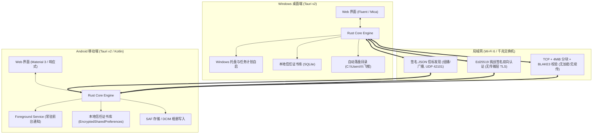
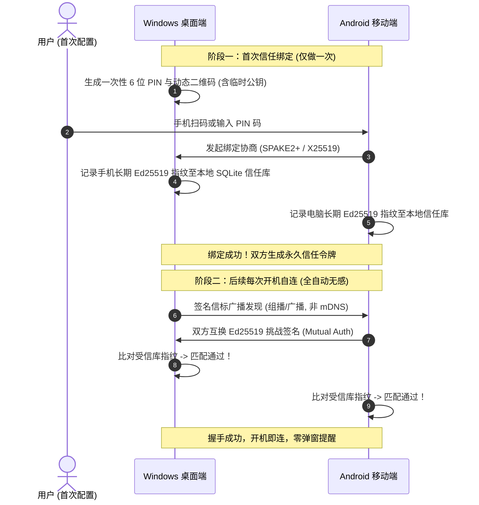

# 飞梭 (Feisuo) 多端架构设计与落地框架方案白皮书

> **设计目标**：构建一款轻量、极速、无感的多端局域网传输工具（重点覆盖 **Windows 桌面端** 与 **Android 安卓端**）。  
> **核心体验**：**开机自启、入网自连、一次信任、无人值守、极速传输**。

---

## 📌 阅读前必读：本文档是"设计目标"，不是"已交付清单"

本白皮书写于项目立项时，其中**传输层的关键选型后来发生了变化，部分能力至今未落地**。
为免误导，文档内每个受影响的小节都加了 **⚠️ 实现状态说明** 与逐条对照表。

**当前最需要知道的四条事实：**

1. **没有 QUIC**。数据通道是 `tokio::net::TcpStream`，没有多路复用，Wi-Fi 漫游会断流。
2. **没有传输层加密**。安全性由"仅允许已配对设备 + 每帧 Ed25519 签名 + 信任库白名单"
   三条保证，但同网段被动嗅探者能读到文件内容。这是**有意识的取舍**，不是遗漏。
3. **没有断点续传**。断线后整份重传。
4. **没有 mDNS / DNS-SD**。发现走的是自有的签名 JSON 信标 + 组播/广播。

**下一阶段设计（尚未实施）**：信任模型重构（`pending` / `permanent` / `session`
三态 + 隐藏）、拖拽直发、剪贴板发送、双栏穿梭改为真实文件系统（含可访问范围配置）、
以及传输层分块 AEAD —— 完整方案见
**[DESIGN_TRUST_SHUTTLE.md](file:///d:/dev/agent-repos/feisuo/DESIGN_TRUST_SHUTTLE.md)**。

**已经真正落地并有 32 项端到端集成测试覆盖的部分：**

| 能力 | 说明 |
| :--- | :--- |
| 签名信标发现 | 组播 + 全局广播 + 各网卡子网定向广播 + 旧 IP 单播回呼 |
| 配对 | 6 位 PIN（限流 / 锁定 / 常量时间比较）+ 设备 ID 防劫持 |
| 传输 | TCP + 4 MiB 分块 + 逐块 BLAKE3 + 落盘后整文件复核 |
| 落盘 | `create_new` 独占创建 + 序号去重，**绝不覆盖**已有文件 |
| 目录结构 | 穿梭取回保留对端相对目录层级，逐段穿越校验 |
| 目录浏览 | 子文件夹导航（面包屑）+ 条目上限截断（1000）并显式提示 |
| 移动端 | 前台保活服务 + 开机广播 + 系统分享 target + JNI 桥接真实引擎 |
| 桌面端 | 托盘常驻 / 关闭行为可选 / 静默无黑窗派生 |

**尚未做的（按优先级）**：传输层加密 → 断点续传 → 端到端吞吐实测 →
Android 侧完整 UI（目前仅原生占位界面 + 服务常驻）。

---

## 目录
1. [多端技术选型决策矩阵](#1-多端技术选型决策矩阵)
2. [总体系统架构设计](#2-总体系统架构设计)
3. [运行生命周期与锁屏保障机制 (PC & Android)](#3-运行生命周期与锁屏保障机制-pc--android)
4. [“开机即连通”：零配置网络发现协议](#4-开机即连通零配置网络发现协议)
5. [一次配对·终生信任的安全通信模型](#5-一次配对终生信任的安全通信模型)
6. [超高速文件传输引擎设计](#6-超高速文件传输引擎设计)
7. [多端系统原生深度整合](#7-多端系统原生深度整合)
8. [开发落地实施路线图](#8-开发落地实施路线图)

---

## 1. 多端技术选型决策矩阵

为了满足“开机自启、后台守护、极小资源占用、高吞吐传输、跨桌面与安卓”的需求，我们对主流技术栈进行了多维评测：

| 评估维度 | 方案 A: Tauri v2 (Rust + Web) ⭐ **推荐** | 方案 B: Flutter + Rust (Bridge) | 方案 C: Electron + Node.js | 方案 D: 双原生 (WinUI + Kotlin) |
| :--- | :--- | :--- | :--- | :--- |
| **支持平台** | **Windows, Android**, macOS, Linux, iOS | Windows, Android, macOS, Linux | 仅桌面端 (Windows, Mac, Linux) | Windows, Android |
| **内存开销 (常驻)** | **20MB ~ 35MB** (极轻量) | 45MB ~ 70MB | 150MB ~ 300MB (过重，自启负担大) | 25MB ~ 40MB |
| **安装包体积** | **15MB ~ 25MB** | 35MB ~ 50MB | 90MB ~ 150MB+ | 20MB ~ 30MB |
| **I/O 传输吞吐** | **极高** (Rust 零拷贝 + Tokio 异步管道) | 高 (需经过 Dart FFI 内存桥接) | 中高 (Node Buffer 性能受限) | 极高 (原生 Socket / Direct I/O) |
| **开机自启与托盘** | 原生插件完善 (`tauri-plugin-autostart`) | 需额外封装 Win32 托盘与后台广播 | 托盘成熟，但自启太慢常驻吃内存 | 深度支持，需双端独立维护 |
| **UI 复用度** | **95%** (一套响应式现代 Web 界面自适应) | 90% (Widget 共享) | 0% (无法编译安卓移动端) | 0% (两套完全独立 UI) |

### 最终架构选型结论
选用 **Tauri v2 + Rust 核心网络引擎 + Vue 3 / Svelte 响应式前端**：
- **核心计算与传输层 (Rust)**：负责签名信标广播探测、Ed25519 签名验证、TCP 分块文件传输（4 MiB 分块 + BLAKE3 校验）、系统托盘与自启配置。
  - ⚠️ 原写的 mDNS / QUIC / 零拷贝 / 传输层 TLS **均未实现**，详见第 4、6 节的实现状态对照表。
- **界面展示层 (Web/HTML5)**：一套前端代码，通过容器查询与自适应流式布局，在 Windows 上呈现精致 Fluent/Mica 桌面窗口，在 Android 上呈现沉浸式 Material 3 移动体验。

---

## 2. 总体系统架构设计



---

## 3. 运行生命周期与锁屏保障机制 (PC & Android)

### 3.1 Windows 桌面端实现方案
1. **开机自启注册**：
   - 方式一：注册表 `HKEY_CURRENT_USER\Software\Microsoft\Windows\CurrentVersion\Run` 添加自启项，附加启动参数 `--daemon`。
   - 方式二（更佳）：调用 Windows **Task Scheduler (任务计划程序)** API 创建登录自启任务。
     - 优势：绕过 UAC 弹窗限制，开机无需管理员再次确认；支持“网络连接成功后立即触发”的高级条件。
2. **托盘常驻与无窗运行**：
   - 当启动带 `--daemon` 参数时，主窗口保持 `visible: false`，仅在系统托盘通知区展示小图标；
   - 拦截主窗口关闭事件（`CloseRequested`）：调用 `window.hide()`，禁止真正 `ExitProcess`；
   - 托盘菜单提供快捷操作：“打开主面板”、“打开接收文件夹”、“开机自启动开关”、“退出飞梭”。
3. **防火墙静默穿透**：
   - 安装包（Inno Setup / MSI）在初次安装阶段自动向 Windows Defender 防火墙注册允许飞梭进程的入站 UDP/TCP 端口规则，避免日常使用弹出“Windows 安全警报”打扰用户。

### 3.2 Android 移动端实现方案（随用随开 · 退出即停 · 锁屏保障）
按用户与轻量无打扰产品设计，Android 端**彻底去除开机自启与 24x7 强行后台驻留**，杜绝偷跑流量与电量消耗：
1. **去开机自启与去常驻**：
   - 移除 `RECEIVE_BOOT_COMPLETED` 广播接收器；不向系统申请自启动；
   - 随应用启动激活服务（`android:stopWithTask="true"`），在用户滑动清除卡片或退出时调用 `onTaskRemoved` 立即 `stopSelf()` 并完全关闭 Rust 网络引擎 (`FeisuoRuntime.shutdown()`)，零后台驻留。
2. **锁屏与熄屏可用性保障**：
   - 当应用处于打开状态且用户关闭手机屏幕（锁屏）时，为了防止 Android 系统休眠 Wi-Fi 网卡组播过滤机制导致局域网无法探测，服务持有 `WifiManager.MulticastLock`；
   - 在活跃传输进行期间持有 `PowerManager.PARTIAL_WAKE_LOCK`，确保大文件传输在锁屏期间不被系统挂起中断。
3. **会话级前台服务通知**：
   - 启动具有 `foregroundServiceType="connectedDevice|dataSync"` 的临时会话通知；
   - 通知文案明确提示：“`局域网待命中 · 锁屏状态下可正常接收`”，用户一眼可知运行状态并可一键停止服务。
4. **网络状态动态自愈监听**：
   - 注册 `ConnectivityManager.NetworkCallback`，一旦手机连接至家庭/办公室 Wi-Fi，立即主动向局域网广播探测包，与电脑握手复联。

---

## 4. “开机即连通”：零配置网络发现协议

飞梭不需要中心服务器，设备入网后即可彼此感知。

### 4.1 发现协议（实际实现）

> ⚠️ **不是 mDNS / DNS-SD。** 原设计写的是 mDNS（`224.0.0.251:5353` +
> `_feisuo._tcp.local.` TXT 记录），**尚未实现**。
> 当前是自有的**签名 JSON 信标 + 组播/广播**方案，端口 `42101`。

- **信标内容**（`protocol::BeaconPacket`，Ed25519 签名）：

  ```json
  {
    "version": 1,
    "device_id": "feisuo-<公钥指纹前 12 位>",
    "device_name": "随身 Pixel",
    "os_type": "android",
    "transfer_port": 42100,
    "timestamp": 1759240000,
    "nonce": "uuid-v4",
    "signature": "ed25519:base64"
  }
  ```

- **广播目标**（每 3 秒一轮，`DiscoveryService::compute_broadcast_targets`）：
  1. `127.0.0.1:<discovery_port>` 与 `127.255.255.255:<port>`
     —— 回环受限广播，实测可送达同机任意回环地址上的监听者，
     让同机双实例（联调 / 自动化测试）也能互相发现；
  2. 组播地址 `224.0.0.251`；
  3. 受限全局广播 `255.255.255.255`（组播被路由器拦截时兜底）；
  4. **各网卡的子网定向广播** —— 早期实现只发 `/24`，
     在 `/16`～`/23` 掩码的局域网里完全发不出去；
  5. 信任库里缓存的受信设备旧 IP（单播回呼）。

- **接收端校验**：时间戳偏差 > `MAX_HANDSHAKE_SKEW_SECS`(120s) 判为重放丢弃；
  签名验不过直接丢；按 `device_id` 过滤掉自己。
  离线设备在 `get_online_devices()` 中按 `last_seen_secs` 阈值剔除。

### 4.2 自连握手流程
1. **广播阶段**：引擎每 3 秒发一轮签名信标；
2. **IP 历史回呼**：并发单播探测信任库里的旧 IP
   （单播用 **socket 实际绑定端口**而非配置值 —— 端口被占用回退时
   用配置端口单播永远发不到对方）；
3. **主动探测**（`probe_device`）：发单播信标后等 1.2s，
   按**来源 IP** 匹配应答。
   ⚠️ 早期实现按 beacon 的 `nonce` 匹配，而对端回信用的是它自己的新 nonce，
   两边永远对不上 —— 结果是"直连探测"恒定超时，而 UI 上"已识别设备"是句空话。

> ❌ **"开机 50ms 内自连"未达成也未实测。** 实际自连时间受
> 首轮广播间隔（3s）与 Wi-Fi 关联耗时支配，未做过端到端测量。

---

## 5. 一次配对·终生信任的安全通信模型

飞梭遵循“**私密、极简、无人值守**”原则，避免类似传统工具频繁弹窗确认的痛点。



> **配对协议实际实现**：6 位 PIN + Ed25519。
> 原设计写的 `SPAKE2+ / X25519` **未实现**，当前是
> 一次性 PIN 校验 + 双方公钥交换（`HandshakeRequest.sender_public_key_hex`）。
> 安全底线靠三条兜住：PIN 限流（同一 IP 5 次失败锁 60s）、
> 常量时间比较、**设备 ID 不可劫持**（已存在的 `device_id` 绑定新公钥会被拒绝）。
> "批准即写入信任条目"也是补齐后才真正成立的 —— 早期实现在审批通过后
> 并没有落库，"一次配对终生免密"实际是假的。

- **安全防御**：即使局域网内存在恶意第三方伪造设备名称，因无法提供匹配的 Ed25519 私钥签名，将被内核直接静默丢弃，绝不会触发接收弹窗。

---

## 6. 超高速文件传输引擎设计

局域网文件传输的核心目标是：**跑满千兆网卡与 Wi-Fi 6 极限，小文件不卡顿，大文件稳定**。

> ⚠️ **实现状态说明（必读）**
>
> 本节原先描述的是 **QUIC + 断点续传** 的目标方案。**这些都尚未实现。**
> 当前落地的是 **TCP + 4MiB 分块 + BLAKE3 校验 + 落盘后整文件复核**。
> 下表逐条列出了设计与现实的差异，请勿再把本文档当作已交付能力的说明书。
>
> | 能力 | 设计目标 | 实际实现 | 状态 |
> | :--- | :--- | :--- | :--- |
> | 数据通道 | QUIC (quinn / s2n-quic) | **TCP + Tokio** (`tokio::net::TcpStream`) | ❌ 未实现 |
> | 单连接多路复用 | 多文件元数据并行 | 单连接顺序传输，文件间无并发 | ❌ 未实现 |
> | Wi-Fi 漫游不断流 | 连接 ID 保持 | 漫游后 TCP 断开，**需重新传输** | ❌ 未实现 |
> | 传输加密 | 原生 TLS 1.3 | **无传输层加密**，安全性由 Ed25519 双向签名 + 受信设备白名单保证 | ⚠️ 设计变更 |
> | 分块粒度 | 4MB | 4 MiB (`CHUNK_SIZE`) | ✅ 已实现 |
> | 分块校验 | BLAKE3 | BLAKE3，逐块校验 | ✅ 已实现 |
> | 整文件校验 | — | 落盘后整文件 BLAKE3 复核，不符即删 | ✅ 已实现 |
> | 断点续传 | Block Bitmap 续传 | **无**。断线后整份重传 | ❌ 未实现 |
> | 吞吐量 | 100 MB/s+ | **未做过端到端实测**，无数据支撑该数字 | ⚠️ 无依据 |
>
> **关于传输层不加密的说明**：这是有意识的取舍，不是遗漏。
> 传输只允许在已配对（双向 Ed25519 握手通过）的设备之间进行，
> 且每一帧的关键字段（传输清单、分块头）都有签名；数据体本身依赖
> 局域网可信假设。代价是同网段被动嗅探者能读到文件内容。
> 若要收口，需要补 QUIC 或在分块体上叠加 AEAD。

### 6.1 实际协议选型：TCP + Tokio

- **核心数据通道**：`tokio::net::TcpStream`，`set_nodelay(true)` 关闭 Nagle 算法；
- **超时兜底**：每一段 `write_all` / `flush` 都套 `tokio::time::timeout`（30s），
  裸 `write_all` 在对端停止读取时会**永久**挂起，表现为 UI 进度条卡死且任务无法取消；
- **阻塞隔离**：4 MiB 分块的同步磁盘读写、整文件 BLAKE3 全部走
  `spawn_blocking`，避免占住 runtime worker 把发现广播与心跳一起饿死。

### 6.2 分块传输与 BLAKE3 极速校验
- **分块粒度**：`4 MiB` (`protocol::CHUNK_SIZE`)；
- **校验算法**：**BLAKE3**，两处校验：
  1. 逐块校验（`ChunkHeader.chunk_blake3`），不符立即中止并清理半成品；
  2. 落盘后整文件复核（`FileMeta.blake3_hash`），截断/损坏的文件绝不会被当作成功。
- **清单签名**：`TransferManifest` 在传输前由发送方用 Ed25519 签名，
  接收方验证后才开始读文件体 —— 防止对端在传输途中篡改文件名 / 大小 / 分块数。
- **断点续传**：**未实现**。网络中断后必须整份重传。

### 6.3 自动落盘策略
- **Windows 默认路径**：`%USERPROFILE%\feisuo\`
- **Android 默认路径**：`/sdcard/Download/feisuo/`
  （⚠️ 注册入 MediaStore 相册**未实现**）
- **重名处理**：若存在同名文件，自动以 `文件名 (1).ext` 递增保存，
  确保无人值守接收安全，**绝不覆盖已有文件**。落位用 `create_new` 独占创建，
  避免两个并发同名传输拿到同一路径互相覆盖。
- **目录结构**：穿梭"取回"会保留对端的相对目录层级
  （如 `2026/报表/1月.csv` → 本机 `2026/报表/1月.csv`），
  逐段做穿越校验 + 落盘前二次 canonicalize 确认未逃逸。
- **目录浏览**：支持子文件夹导航（面包屑 + 上级），
  条目数上限 `MAX_BROWSE_ENTRIES = 1000`，
  超出时返回 `truncated = true` 并在界面显式提示 ——
  不加截断的话，几万个文件的目录会拼出超过 `MAX_JSON_FRAME`（1 MiB）的
  应答，对端读帧直接被拒。

---

## 7. 多端系统原生深度整合

> ⚠️ 本节原先把一批**尚未实现**的能力写成了既成事实（托盘图标拖放、右键菜单、
> Windows Toast 横幅、Android 状态栏进度卡片）。下面改为逐条标注实际状态，
> 避免文档与产品行为不一致 —— 文档承诺了而代码没有，比功能缺失更容易误导。

### 7.1 集成能力状态对照

| 能力 | 设计目标 | 实际实现 | 状态 |
|:---|:---|:---|:---|
| 窗口内拖拽发送 | 拖文件进窗口即发送 | 网页层 HTML5 `@drop` | ✅ 已实现 |
| Tauri 原生文件拖放 | 窗口失焦/隐藏也能接收 | `getCurrentWebview().onDragDropEvent` | ✅ 已实现 |
| 拖放时唤出隐藏窗口 | 托盘常驻下拖放也有反馈 | `ensure_window_visible` 命令 | ✅ 已实现 |
| 完成/失败/审批时唤出窗口 | 托盘常驻下用户能知道 | `ensure_window_visible` | ✅ 已实现 |
| 拖拽至**托盘图标** | 拖到任务栏图标直接发 | **无**（`tray.rs` 只处理 `Click`） | ❌ 未实现 |
| 文件右键菜单 (Shell Context Menu) | 右键 -> 发送到 -> 飞梭设备 | **无**（未写任何注册表项） | ❌ 未实现 |
| Windows Toast 通知 | 传输完成弹系统横幅 | 唤出窗口 + 应用内 `.fluent-toast` | ⚠️ 窗口会被唤出, 但无系统级横幅 |
| 点击通知高亮文件 | 资源管理器定位 | **无** | ❌ 未实现 |
| Android 系统分享菜单 | 相册/微信"分享"里出现飞梭 | `ShareTargetActivity` + `ShareDispatcher` | ✅ 已实现 |
| Android 失败自动补发 | 电脑上线后自动重发 | 守护服务在引擎就绪/网络恢复时重试 | ✅ 已实现 |
| Android 配对 | 输入 6 位码完成双向绑定 | `pairWithDevice` + IP/PIN 表单 | ✅ 已实现 |
| Android 人工审批 | 未配对设备投递时弹窗确认 | 高优先级通知 + 允许/拒绝动作 | ✅ 已实现 |
| Android 状态栏进度卡片 | 实时进度 + 速率 | 静态常驻通知 + 停止按钮 | ❌ 未实现 |

### 7.2 拖放的两条路径

拖放有**两条**通路，缺一不可：

1. **网页层 `@drop`** —— 窗口可见时的即时视觉反馈（高亮投放区）；
2. **Tauri 原生拖放事件** —— 真正拿到磁盘路径。浏览器 `File` 对象在
   WebView2 下拿不到真实路径，没有这条通路就发不出文件。

因为飞梭是**托盘常驻**应用，窗口经常处于隐藏状态，而原生拖放在隐藏时
照样会触发。所以 `handleNativeDrop` 会先调 `ensure_window_visible`
把窗口唤出来 —— 否则用户把文件拖到看不见的地方，文件确实进了发送清单，
却没有任何可见反馈，表现为"拖了没反应"。

拖放只负责"加入发送清单"，选设备与实际发送仍由用户确认。

### 7.3 托盘常驻下的"用户可感知性"

飞梭的产品形态是**关窗不退出、托盘常驻**，因此"窗口隐藏"是常态而非异常。
凡是**需要用户知道或决定**的事件，都必须主动把窗口唤出来，否则会静默失效：

| 事件 | 不唤出的后果 |
|:---|:---|
| 原生拖放 | 文件进了发送清单，但用户看不到，表现为"拖了没反应" |
| 传输完成 / 失败 | 无人值守场景下用户永远不知道文件已到（或已失败） |
| 人工审批请求 | 弹窗不可见 → core 只等 60 秒 → 静默等满后被拒；对方以为传成功、本机什么都没发生，双方对不上账 |

三处统一走 `ensure_window_visible` 命令：它先 `is_visible()` 判断，
窗口已可见时是空操作，所以不会打断正在使用界面的用户。

**尚未实现系统级横幅**：本地依赖里没有 `tauri-plugin-notification`，
因此当前只能做到"唤出窗口 + 应用内 toast"。

> ⚠️ **该限制已解除（2026-09-30 核实）**：原因为"当前环境无法拉取新依赖"，
> 但实测 `https://index.crates.io/config.json` 返回 `200`，
> `tauri-plugin-notification` / `tauri-plugin-global-shortcut` /
> `tauri-plugin-clipboard-manager` 现在均可直接引入。
> 需要"系统级横幅""全局热键""原生剪贴板"时应重新评估走官方插件，
> 见 [DESIGN_TRUST_SHUTTLE.md](file:///d:/dev/agent-repos/feisuo/DESIGN_TRUST_SHUTTLE.md) §10。

### 7.4 Android 分享链路的实际行为

分享 → 同步落盘到应用私有暂存区（必须在 `finish()` 前，URI 授权随即回收）
→ 后台线程推送至第一台已配对设备（探测其当前传输端口，因为信任库只记 IP 不记端口）
→ 成功则删除暂存副本。

推送失败（未配对 / 电脑离线 / 传输出错）时文件**保留**在暂存区，
由 `FeisuoDaemonService` 在**引擎就绪**与**网络恢复**两个时机自动补发。
暂存区有上界（200 个文件 / 256 MiB），越界时按时间丢弃最早的文件并在日志中记录，
不会静默占满用户存储。

### 7.5 配对：曾经整条发送链路都不可达

Android 界面曾长期存在一个**说谎的按钮**：

- 说明文字写着"在下方输入桌面端显示的 6 位配对码"；
- 按钮标题是"输入配对码"；
- 点击后只弹一句"配对界面将在后续版本接入"。

而"一次配对、终生免密"是产品核心承诺。配不上就直接导致两件事：
分享推送永远命中"尚未配对任何电脑"（整条发送链路不可达），
且未配对电脑无法向本机投递（fail-closed）。

现在 `MainActivity` 提供了真实表单：填电脑局域网 IP + 6 位码，点「配对」。
流程刻意**先探测再配对** —— 信任库与信标里记的是 IP，而传输端口是对端
可在设置里改的，直接用默认端口连必然失败。配对成功后立即刷新并展示
受信设备列表，用户能直接看到结果。

### 7.6 人工审批：fail-closed 曾让 Android 变成单向黑洞

传输服务端对未受信设备是 **fail-closed** 的 —— 找不到能应答的审批者就直接拒绝。
而 `engine_host::boot_engine` 原先有一行：

```rust
drop(handles.approval);   // 三个事件接收端在此被丢弃
```

丢掉 broadcast 接收端后 `approval_tx.send()` 必然返回 `Err`，于是：

- **任何电脑都无法向 Android 投递文件**（哪怕对方已实现审批也不管用）；
- 用户连"有传输在等你确认"这件事都看不到。

行为上是安全的（不会静默接受未授权文件），但功能上等于只能收不能判断。

现在 `engine_host` 把审批事件转发到宿主可消费的队列
（`install_approval_forwarder` / `next_approval` / `respond_approval`），
守护服务起一个后台线程轮询，弹出**高优先级**通知带「允许 / 拒绝」两个动作。

高优先级是必需的：审批只等 60 秒，若走静默渠道（`IMPORTANCE_LOW`）
用户注意不到，请求会直接等满超时 —— 那等于没实现。

### 7.7 应用内更新：绿色版 exe 不能被覆写，于是要"换名接力"

桌面端带**应用内更新**（`desktop/src-tauri/src/updater.rs`），
与 QuickClip 的 `UpdateService` 同源，但产物形态不同因而实现路径不同。

#### 为什么不接 `tauri-plugin-updater`

官方插件要求 Release 里放 `latest.json` + `.sig`，校验依赖打包期注入的
`pubkey`。而飞梭是**无签名绿色版**（`bundle.active = false`），
强行接入等于凭空引入一套签名密钥管理体系，与"零配置、免安装"的定位相悖。
因此自研：GitHub/Gitee Release API → 下载 exe → 换名接力 → 重启。

#### 换名接力：为什么不能直接覆盖

Windows 上正在运行的 exe 被内核独占，**既不能覆写也不能删除**。
常规解法是外置 updater 进程，但绿色版目录里只有 `feisuo-desktop.exe`，
旁边没有 helper。于是采用四步接力：

| 步骤 | 动作 | 说明 |
|:---|:---|:---|
| 1 | 复制新版本到 `xxx.exe.new` | 更新包在 `%LOCALAPPDATA%`，必须**复制**不能移动 |
| 2 | 当前 exe 改名为 `xxx.exe.new.old` | 改运行中 exe 的**名字**是 Windows 允许的 |
| 3 | `xxx.exe.new` 改名为正式名 | 此刻原路径已空出来 |
| 4 | 拉起正式名的新实例后退出 | 沿用原参数（`--daemon`） |

第 2 步失败**必须回滚**（`apply_rollover`）—— 否则用户电脑上就再也没有
飞梭了。而第 3 步的旧映像此刻仍被占用，只能留给**下次启动**清理
（`apply_rollover_if_needed`，在 `main()` 读配置**之前**同步执行，
晚一步就会与引擎抢同一批文件句柄，表现为"更新后偶发启动失败"）。

#### 三条降级通道与熔断

检查顺序 **Gitee API → GitHub API → GitHub Releases 页面**。
第三条不碰 API 限流，只用 CDN 与 HTML，作为前两条都不可用时的兜底。

调度：启动 8 秒后首次 → 成功后每 12 小时 → 失败则 3 分钟后重试，
**连续 7 次熔断**到下一个常规周期。熔断是必要的：用户拔网线或公司防火墙
拦截时，不熔断就是每 3 分钟一次无效请求，笔记本指示灯常年亮。

#### 唯一的远程执行面：下载地址白名单

下载 URL 完全来自远端 JSON 响应，`is_trusted_download_url` 是硬闸门：
只放行 `*.gitee.com` / `*.github.com` / `*.githubusercontent.com`。
少了这一条，一个被 DNS 劫持或 API 篡改的响应就能让客户端下载并执行任意 exe。
同理 `open_url_in_browser` 拒绝非 `http(s)` 协议 ——
放行 `file://` 等于给远端一个本地执行入口。

#### 为什么这些失配要用测试钉住

更新链路的每一环都跨语言边界，**编译期完全无感**。而它的失败模式
特别隐蔽：

- 只接了 `check_for_update` 没接 `apply_update` → 界面显示"新版本已下载就绪"
  然后**永远没有下一步**，比没有更新功能更糟（让用户以为程序坏了）；
- Cargo 版本与 tag 不一致 → 要么永远提示有新版，要么永远"已是最新"；
- 删掉回滚那一行 → 用户直接失去飞梭。

`update_guard.rs` 把这些都变成测试失败（沿用 `wiring_guard` 的思路）。
其中回滚删除与版本号不一致两条，已实测确认守卫会真的报红。

---

## 8. 开发落地实施路线图


---
*本文档为飞梭跨端局域网传输系统的正式架构参考标准。*
