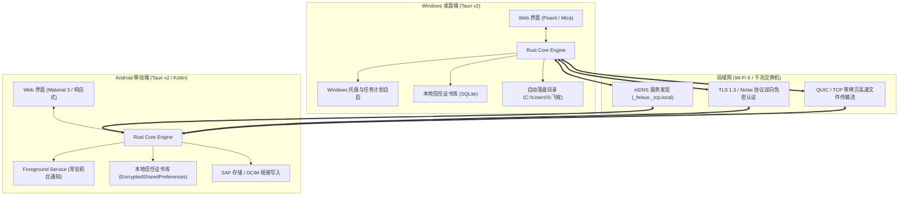
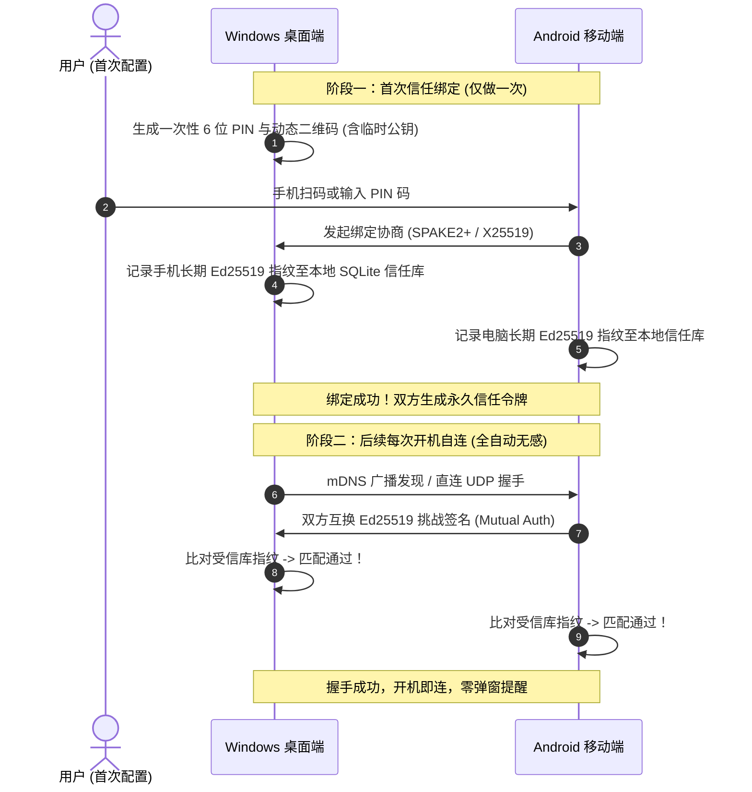
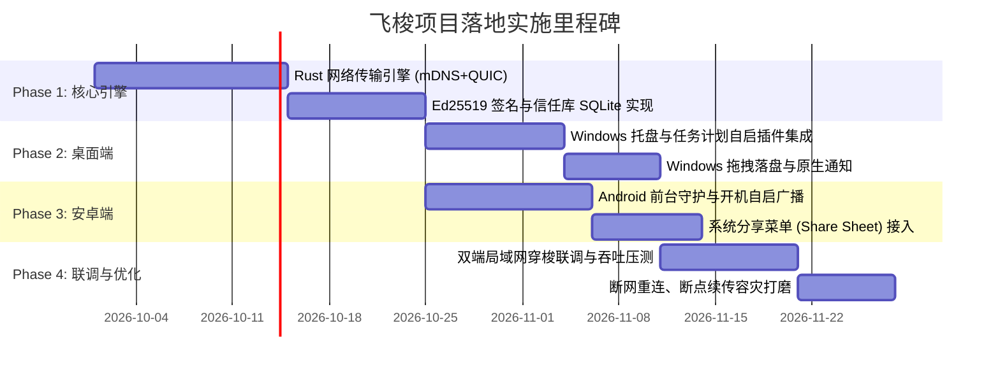

# 飞梭 (Feisuo) 多端架构设计与落地框架方案白皮书

> **设计目标**：构建一款轻量、极速、无感的多端局域网传输工具（重点覆盖 **Windows 桌面端** 与 **Android 安卓端**）。  
> **核心体验**：**开机自启、入网自连、一次信任、无人值守、极速传输**。

---

## 目录
1. [多端技术选型决策矩阵](#1-多端技术选型决策矩阵)
2. [总体系统架构设计](#2-总体系统架构设计)
3. [开机自启与后台常驻机制 (PC & Android)](#3-开机自启与后台常驻机制-pc--android)
4. [“开机即连通”：零配置网络发现协议](#4-开机即连通零配置网络发现协议)
5. [一次配对·终生信任的安全通信模型](#5-一次配对终生信任的安全通信模型)
6. [超高速文件传输引擎设计](#6-超高速文件传输引擎设计)
7. [多端系统原生深度整合](#7-多端系统原生深度整合)
8. [开发落地实施路线图](#8-开发落地实施路线图)

---

## 1. 多端技术选型决策矩阵

为了满足“开机自启、后台守护、极小资源占用、高吞吐传输、跨桌面与安卓”的需求，我们对主流技术栈进行了多维评测：

| 评估维度 | 方案 A: Tauri v2 (Rust + Web) ⭐ **推荐** | 方案 B: Flutter + Rust (Bridge) | 方案 C: Electron + Node.js | 方案 D: 双原生 (WinUI + Kotlin) |
| :--- | :--- | :--- | :--- | :--- |
| **支持平台** | **Windows, Android**, macOS, Linux, iOS | Windows, Android, macOS, Linux | 仅桌面端 (Windows, Mac, Linux) | Windows, Android |
| **内存开销 (常驻)** | **20MB ~ 35MB** (极轻量) | 45MB ~ 70MB | 150MB ~ 300MB (过重，自启负担大) | 25MB ~ 40MB |
| **安装包体积** | **15MB ~ 25MB** | 35MB ~ 50MB | 90MB ~ 150MB+ | 20MB ~ 30MB |
| **I/O 传输吞吐** | **极高** (Rust 零拷贝 + Tokio 异步管道) | 高 (需经过 Dart FFI 内存桥接) | 中高 (Node Buffer 性能受限) | 极高 (原生 Socket / Direct I/O) |
| **开机自启与托盘** | 原生插件完善 (`tauri-plugin-autostart`) | 需额外封装 Win32 托盘与后台广播 | 托盘成熟，但自启太慢常驻吃内存 | 深度支持，需双端独立维护 |
| **UI 复用度** | **95%** (一套响应式现代 Web 界面自适应) | 90% (Widget 共享) | 0% (无法编译安卓移动端) | 0% (两套完全独立 UI) |

### 最终架构选型结论
选用 **Tauri v2 + Rust 核心网络引擎 + Vue 3 / Svelte 响应式前端**：
- **核心计算与传输层 (Rust)**：负责 mDNS 广播探测、UDP 握手保活、Ed25519 签名验证、QUIC/TCP 零拷贝分块文件传输、系统托盘与自启配置。
- **界面展示层 (Web/HTML5)**：一套前端代码，通过容器查询与自适应流式布局，在 Windows 上呈现精致 Fluent/Mica 桌面窗口，在 Android 上呈现沉浸式 Material 3 移动体验。

---

## 2. 总体系统架构设计



---

## 3. 开机自启与后台常驻机制 (PC & Android)

要做到用户要求的“**开机就能够连通，关窗口也能收文件，方便传输**”，两端的后台常驻必须攻克以下关键技术点：

### 3.1 Windows 桌面端实现方案
1. **开机自启注册**：
   - 方式一：注册表 `HKEY_CURRENT_USER\Software\Microsoft\Windows\CurrentVersion\Run` 添加自启项，附加启动参数 `--daemon`。
   - 方式二（更佳）：调用 Windows **Task Scheduler (任务计划程序)** API 创建登录自启任务。
     - 优势：绕过 UAC 弹窗限制，开机无需管理员再次确认；支持“网络连接成功后立即触发”的高级条件。
2. **托盘常驻与无窗运行**：
   - 当启动带 `--daemon` 参数时，主窗口保持 `visible: false`，仅在系统托盘通知区展示小图标；
   - 拦截主窗口关闭事件（`CloseRequested`）：调用 `window.hide()`，禁止真正 `ExitProcess`；
   - 托盘菜单提供快捷操作：“打开主面板”、“打开接收文件夹”、“开机自启动开关”、“退出飞梭”。
3. **防火墙静默穿透**：
   - 安装包（Inno Setup / MSI）在初次安装阶段自动向 Windows Defender 防火墙注册允许飞梭进程的入站 UDP/TCP 端口规则，避免日常使用弹出“Windows 安全警报”打扰用户。

### 3.2 Android 移动端实现方案（破解系统杀后台痛点）
Android 生态存在严格的电池限制策略（Doze 模式、应用待机分组），要实现“开机自连、随开随收”，必须完成以下四大配置：
1. **开机自启广播响应**：
   - 声明 `android.permission.RECEIVE_BOOT_COMPLETED` 权限；
   - 编写 `BootReceiver` 静态广播接收器，在系统重启完成后自动激活应用服务。
2. **前台服务 (Foreground Service) + 常驻不可消除通知**：
   - 启动具有 `foregroundServiceType="connectedDevice|dataSync"` 的前台守护服务；
   - 在通知栏置顶展示轻量静音通知（如：“`飞梭已就绪 · 已连通书房台式 (开机已自连)`”）；
   - 操作系统将该进程标记为高优先级（Low OOM Score），杜绝被系统后台自动清理。
3. **请求忽略电池优化 (Doze Whitelist)**：
   - 首次启动引导用户开启 `android.settings.REQUEST_IGNORE_BATTERY_OPTIMIZATIONS`，避免息屏时 Wi-Fi 被休眠挂起导致传输中断。
4. **网络状态动态自愈监听**：
   - 注册 `ConnectivityManager.NetworkCallback`，一旦手机连接至家庭/办公室 Wi-Fi，立即主动向局域网广播探测包，与电脑握手复联。

---

## 4. “开机即连通”：零配置网络发现协议

飞梭不需要中心服务器，设备入网后即可彼此感知。

### 4.1 mDNS (Multicast DNS) 广播协议设计
- **广播地址**：IPv4 `224.0.0.251:5353`，IPv6 `[FF02::FB]:5353`
- **服务类型**：`_feisuo._tcp.local.`
- **DNS-SD TXT 记录内容**：
  ```json
  {
    "v": "1.0",
    "id": "feisuo-pubkey-fingerprint-a1b2c3",
    "name": "随身 Pixel",
    "os": "Android",
    "port": 42100,
    "state": "idle"
  }
  ```

### 4.2 毫秒级自连握手流程
1. **局域网探测阶段**：设备只要开机加入局域网，后台 Rust 引擎即刻向组播地址发送 mDNS 问询；
2. **IP 历史回呼优先策略**：
   - 发现引擎内部维护最近连接成功的受信设备 IP 列表（如 `100.64.0.18:42100`）；
   - 在 mDNS 广播的同时，并发直接向缓存的旧 IP 发送轻量探测 UDP 包；
   - 在大多数家庭 Wi-Fi 租期未变场景下，**开机 50ms 内即可瞬间恢复连通**！

---

## 5. 一次配对·终生信任的安全通信模型

飞梭遵循“**私密、极简、无人值守**”原则，避免类似传统工具频繁弹窗确认的痛点。



- **安全防御**：即使局域网内存在恶意第三方伪造设备名称，因无法提供匹配的 Ed25519 私钥签名，将被内核直接静默丢弃，绝不会触发接收弹窗。

---

## 6. 超高速文件传输引擎设计

局域网文件传输的核心目标是：**跑满千兆网卡与 Wi-Fi 6 极限（100MB/s+），小文件不卡顿，大文件可断点续传**。

### 6.1 协议选型：QUIC vs Raw TCP
- **核心数据通道**：采用 **QUIC (基于 UDP，使用 Rust `quinn` / `s2n-quic` 库)**；
- **优势**：
  - **单连接多路复用**：多个文件或文件夹元数据并行传输，杜绝 TCP 线头阻塞；
  - **Wi-Fi 漫游不断流**：手机从客厅走到卧室切换路由器 AP 时，连接 ID 保持一致，无需重新握手断连；
  - **原生 TLS 1.3 加密**：硬件 AES/ChaCha20 指令集加速，CPU 占用率低于 3%。

### 6.2 分块传输与 BLAKE3 极速校验
- **分块粒度**：以 `4MB` 为单位进行流式切片；
- **校验算法**：采用 **BLAKE3** 替代传统的 MD5/SHA256：
  - BLAKE3 在现代 CPU 上利用 SIMD 指令集可达 4GB/s+ 的哈希速度，完全不会成为千兆传输的瓶颈；
- **断点续传**：
  - 传输前发送 `TransferManifest` 元数据；
  - 接收方比对本地临时文件已写入的块位图（Block Bitmap），只请求缺失的分块；
  - 支持网络突发断开后，重新连上瞬间自动接续剩余分块。

### 6.3 自动落盘策略
- **Windows 默认路径**：`C:\Users\<Username>\飞梭\`
- **Android 默认路径**：`/sdcard/Download/飞梭/`（图片与视频同步注册入媒体库 MediaStore，在系统相册立即可见）；
- **重名处理**：若存在同名文件，自动以 `文件名 (1).ext` 递增保存，确保无人值守接收安全，绝不覆盖已有文件。

---

## 7. 多端系统原生深度整合

### 7.1 Windows 桌面端特色集成
1. **拖拽至托盘图标**：支持将文件直接拖动到任务栏右下角飞梭图标，直接发送至最近常用设备；
2. **文件右键菜单扩展 (Shell Context Menu)**：支持“右键文件 -> 发送到 -> 飞梭设备”；
3. **Windows 11 Toast 通知中心**：文件传输完成弹出原生系统横幅，点击通知直接调用资源管理器高亮显示该文件。

### 7.2 Android 移动端特色集成
1. **系统级“发送到”分享菜单 (Android Share Target)**：
   - 在系统相册、微信、文件管理器中选中多张照片或大文件，点击系统“分享”，直接显示“飞梭”；
   - 点击后在后台无感完成直传，不强制打开飞梭完整主页面。
2. **状态栏常驻进度卡片**：
   - 传输进行时动态展示进度条与实时速率（如：`88.4 MB/s`），完成后震动提醒并发出提示音。

---

## 8. 开发落地实施路线图



---
*本文档为飞梭跨端局域网传输系统的正式架构参考标准。*
